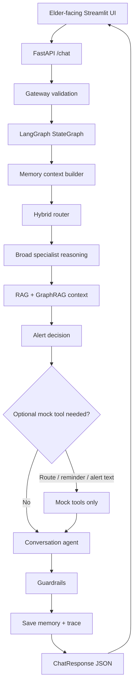

# ElderGuard AI

ElderGuard AI is an interview-ready prototype of a controlled, explainable multi-agent eldercare assistant.

It is **not** a medical device, diagnosis system, prescribing system, emergency service, or production healthcare product. Caregiver alerts are simulated: the app may prepare alert text, but it does not send SMS, calls, email, maps, payments, or emergency requests. Public demos must use synthetic data only.

## Case Study Summary

ElderGuard demonstrates how an elderly-facing chatbot can be wrapped in a controlled care workflow instead of behaving like an unrestricted general chatbot.

The core architecture is:

```text
Streamlit UI
-> FastAPI gateway
-> LangGraph workflow
-> memory context
-> hybrid router
-> specialist reasoning
-> RAG / GraphRAG
-> alert decision
-> optional mock tools
-> conversation agent
-> guardrails
-> save memory
-> technical trace
```

Dify was tested earlier as an optional HTTP client, but it is not part of the main architecture. The main portfolio demo is Streamlit + FastAPI + LangGraph.

## User Problem

Older adults may need help with everyday concerns such as suspicious messages, medication uncertainty, dizziness, loneliness, hunger, or practical support. A free chatbot can be too broad, inconsistent, or hard to explain. ElderGuard narrows the experience into one simple chat interface while keeping specialist reasoning, safety checks, and technical traceability behind the scenes.

## Business/Social Goal

The goal is to show a safe prototype pattern for eldercare support:

- Reduce confusion by giving one simple next step.
- Detect risks that may need caregiver or professional confirmation.
- Keep advanced AI details hidden from elderly users.
- Let caregivers and developers inspect summarized reasoning without exposing secrets.
- Preserve a clear path for future safe tool use.

## Architecture Overview

Elder-facing users interact with one chat companion. Internally, the backend uses a controlled multi-agent loop:

- Gateway validation checks the request shape and creates a request id.
- LangGraph maintains state and execution order.
- Memory context loads recent conversation and user summaries from SQLite.
- Hybrid routing combines deterministic safety rules with an optional local ML router.
- Broad specialist reasoning produces structured evidence only.
- RAG and GraphRAG provide local knowledge snippets and relationship pathways.
- Alert decision prepares caregiver/health/fraud/emergency alert text when policy says it is needed.
- Mock tools can prepare route, reminder, or caregiver alert objects without external calls.
- Conversation agent writes the final user-facing response.
- Guardrails check the response before saving memory and returning to the UI.
- Technical trace records sanitized execution details for the Developer Trace page.

## Mermaid Architecture Diagram



## Harness and Loop Framework Mapping

- **Harness:** FastAPI, Pydantic schemas, LangGraph state, gateway validation, role-gated Streamlit views, admin-protected endpoints.
- **Loop:** memory loading, router, specialist evidence, alert policy, optional mock tools, conversation response, guardrails, save memory.
- **LLM Ops / Observability:** sanitized developer trace, request id, LangGraph path, LLM mode/call count, router decision, alert decision, guardrail issues, local error logs.

## Hybrid Router Design

The router is intentionally hybrid:

- Rule-based safety detection handles high-risk or obvious care situations first.
- Optional local ML routing can help classify normal single-topic messages.
- Rule-based override wins when the message has high-risk terms, multiple relevant agents, or clear safety evidence.
- The elder user never chooses agents manually.

This design is easier to explain in an interview because safety-critical behavior is deterministic and auditable.

## RAG and GraphRAG Design

The RAG layer uses local Markdown knowledge files in `data/knowledge/` and an optional local FAISS vector store. It does not require paid embeddings.

GraphRAG is implemented as a lightweight care knowledge graph in `app/care_graph.py`. It maps signals to explainable pathways, for example:

- `dizziness -> fall_risk -> sit_or_lie_down -> red_flag_questions`
- `unknown_email -> link_risk -> do_not_click -> verify_sender`
- `missed_medication -> medication_uncertainty -> do_not_double_dose -> contact_pharmacist`
- `hunger -> basic_need -> check_available_food -> suggest_simple_food`
- `loneliness -> emotional_distress -> supportive_conversation -> contact_trusted_person`

RAG and GraphRAG are used as context sources, not as autonomous decision makers.

## Memory Design

SQLite stores local prototype memory:

- Conversation messages by `user_id`, `conversation_id`, `role`, `message`, and timestamp.
- Interaction logs for admin/debug review.
- Care events classified as working, episodic, long-term profile, semantic, or do-not-save.
- User summaries and confirmed profile facts.

Memory is used to keep follow-up turns coherent. It should not override the latest user message or turn old topics into current risks.

## Guardrails Design

Guardrails are applied after the conversation agent:

- No diagnosis or prescription.
- No medication dosage changes.
- No claim that alerts were sent.
- No exposure of secrets, prompts, tracebacks, or local file paths in public responses.
- High-risk cases should recommend human confirmation or urgent help when appropriate.

## Human Approval Design

Human approval is placed at risk and action boundaries:

- Caregiver alerts are prepared but not sent.
- Navigation is planned only as a mock future feature and requires explicit location permission.
- Medication uncertainty directs the user to a pharmacist, doctor, clinic, caregiver, or label instructions.
- Emergency-like symptoms recommend contacting local emergency services or a trusted nearby person.

## Evaluation Metrics

This prototype does not claim measured production results. The evaluation plan tracks what should be measured:

- **Technical metrics:** routing accuracy, LLM calls per turn, latency, test pass rate, guardrail hit rate.
- **Business/social value metrics:** task completion, caregiver summary usefulness, reduced confusion, scenario coverage.
- **Risk/trust metrics:** false reassurance, missed alert, unnecessary alert, privacy leakage, role-gate behavior.
- **Operational metrics:** local setup time, admin endpoint protection, error clarity, reproducible demo flow.

See `docs/evaluation_plan.md` for details.

## Current Limitations

- Local prototype only; not production-ready.
- No real emergency, SMS, map, payment, or healthcare integrations.
- Caregiver alerts and reminders are simulated.
- Access codes are lightweight prototype gates, not production identity management.
- SQLite memory is for local demos and synthetic data.
- Optional Kaggle datasets are demonstration data and not clinical guidance.
- Live LLM behavior depends on OpenRouter availability and configured quota.

## Planned Feature: Safe Navigation Agent

The planned Safe Navigation Agent would detect navigation intent, ask for missing location/destination, check safety risk, require location permission, use the mock route tool, and escalate to caregiver support if the user appears lost, confused, dizzy, or high-risk.

This project does not call Google Maps or real location services.

See `docs/navigation_roadmap.md`.

## Interview Talking Points

- ElderGuard is a controlled multi-agent loop, not a free chatbot.
- The elder-facing UI is intentionally simple; technical reasoning is hidden by default.
- LangGraph gives a clear execution path and trace.
- Hybrid routing combines deterministic safety rules with optional ML routing.
- RAG and GraphRAG improve explanation without making medical claims.
- Memory supports follow-up continuity while avoiding unconfirmed facts as truth.
- Human approval is required before simulated alerts become real-world actions.
- The prototype is honest about limits and future production work.

## Setup

Windows commands:

```powershell
python -m venv .venv
.venv\Scripts\activate
pip install -r requirements.txt
uvicorn app.main:app --reload
streamlit run streamlit_app.py
```

Create a local `.env` file from `.env.example`:

```powershell
copy .env.example .env
```

Keep the FastAPI terminal open while using Streamlit. Open a second terminal for Streamlit.

## Environment Variables

```env
LLM_MODE=mock
OPENROUTER_API_KEY=
OPENROUTER_MODEL=openai/gpt-4o-mini
ADMIN_API_TOKEN=change_me
CAREGIVER_ACCESS_CODE=
DEVELOPER_ACCESS_CODE=
KAGGLE_USERNAME=
KAGGLE_KEY=
KAGGLE_API_TOKEN=
```

Do not commit real values. Keep secrets only in `.env`.

## Main Endpoints

- `POST /chat`: public chat turn.
- `GET /status`: safe status for the UI.
- `GET /logs`: admin-protected logs, requires `X-Admin-Token`.
- `POST /download-kaggle-datasets`: admin-protected optional dataset download.
- `POST /rebuild-vector-store`: admin-protected local vector rebuild.

## Optional HTTP Client: Dify

Dify was tested as an optional HTTP client that can call `POST /chat`. It is not required for the main portfolio demo.

Example body:

```json
{
  "message": "{{sys.query}}",
  "user_id": "demo_user",
  "conversation_id": "default"
}
```

## Streamlit Views

- **Chat:** public elder-facing view with large text, safety disclaimer, demo buttons, and simulated caregiver alert cards.
- **Family Summary:** protected by `CAREGIVER_ACCESS_CODE`; shows nontechnical care summaries.
- **Technical Trace:** protected by `DEVELOPER_ACCESS_CODE`; shows routing, trace, alerts, guardrails, and sanitized debug data.
- **AI Model Insights:** protected developer view for local ML router artifacts.

## Demo Scenarios

Use synthetic inputs only:

- `I feel lonely because my friends are busy`
- `A bank caller asked me for my password`
- `I feel dizzy after standing up`
- `I forgot my blood pressure medicine`
- `I am hungry and only have bread`

## Screenshots

Add real screenshots from your local app when preparing your portfolio. Do not fabricate screenshots.

- `docs/screenshots/elder_chat.png`
- `docs/screenshots/caregiver_summary.png`
- `docs/screenshots/technical_trace.png`
- `docs/screenshots/alert_card.png`

## Tests

Run available mock/security checks:

```powershell
python -m pytest tests/test_phase1_security.py tests/test_ml_router.py -q
$env:PYTHONPATH=(Get-Location).Path; python tests/run_alert_tests.py
$env:PYTHONPATH=(Get-Location).Path; python tests/run_guardrail_tests.py
$env:PYTHONPATH=(Get-Location).Path; python tests/run_llm_mode_tests.py
$env:PYTHONPATH=(Get-Location).Path; python tests/run_memory_classifier_tests.py
$env:PYTHONPATH=(Get-Location).Path; python tests/run_reasoning_workflow_tests.py
```

Do not treat passing prototype tests as production validation.

## Future Work

- Split the large LangGraph module into smaller router, agent, safety, and orchestration modules.
- Add stronger identity and consent management.
- Add real notification integrations only with explicit approval, audit logs, and privacy review.
- Improve RAG citations and source quality.
- Add retention controls and conversation deletion.
- Add CI, deployment documentation, load testing, and formal evaluation reports.
