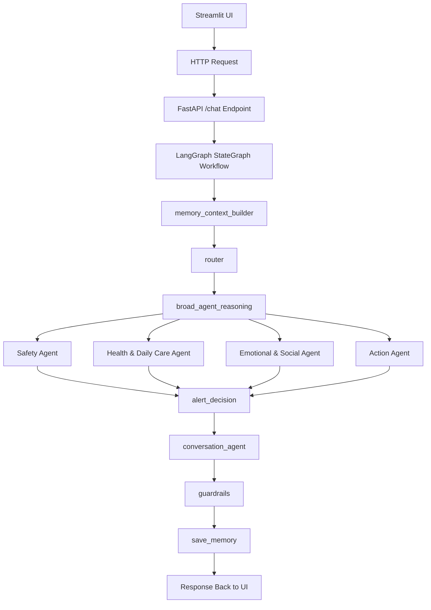
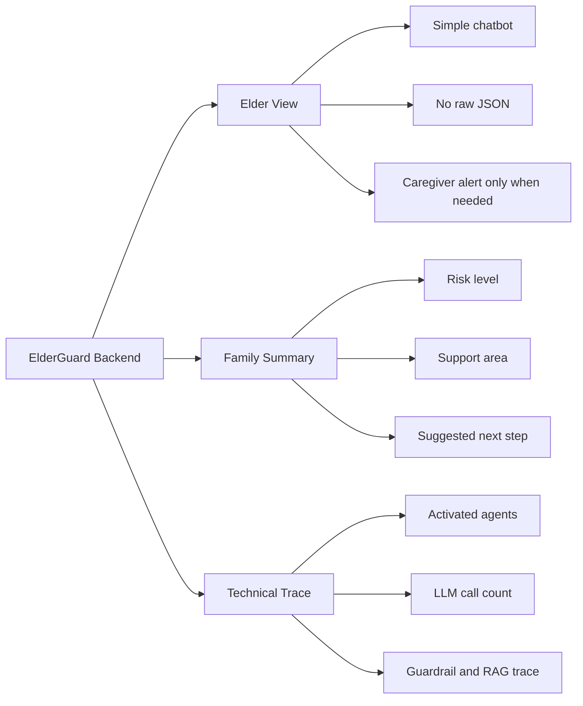
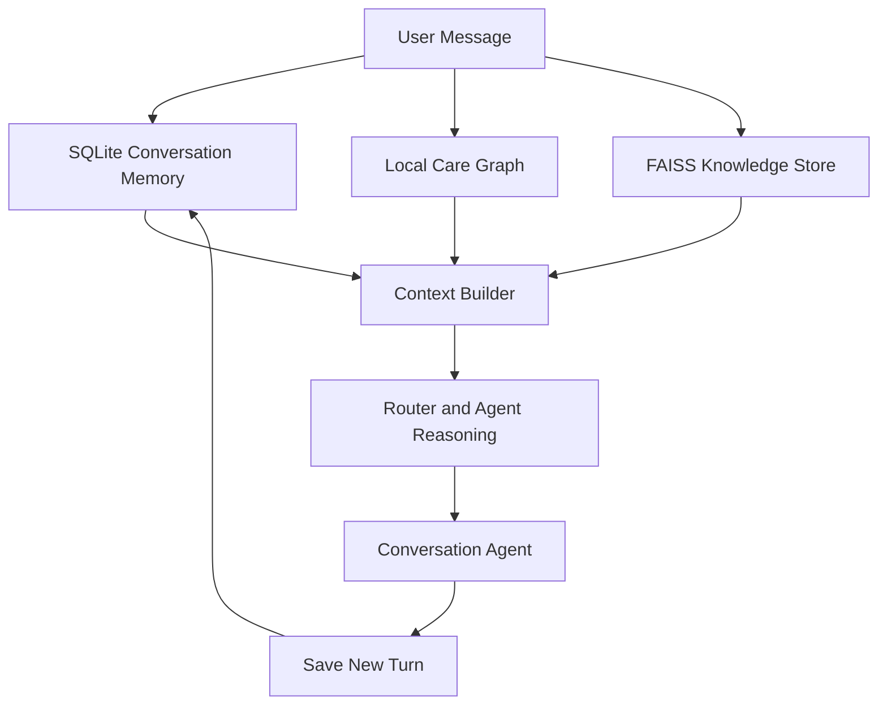
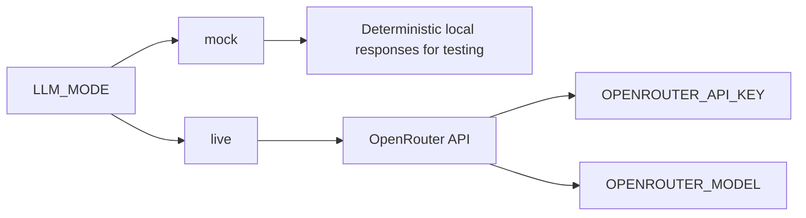
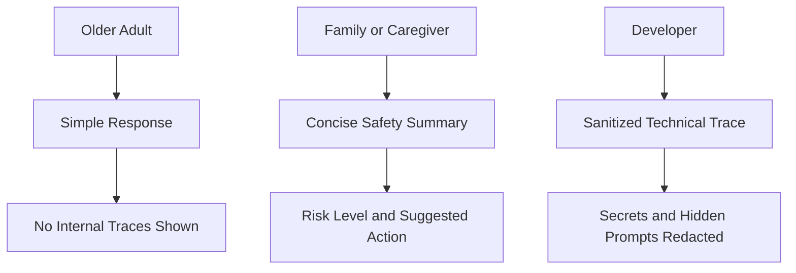

# ElderGuard AI
Safe, explainable multi-agent eldercare assistant( prototype, human in the loop system)


## Project Highlights

| Area | Implementation |
| --- | --- |
| Backend | FastAPI `/chat` endpoint |
| Workflow | Simplified LangGraph `StateGraph` |
| Agents | Safety, Health & Daily Care, Emotional & Social, Action |
| Memory | SQLite conversation logs with `user_id` and `conversation_id` |
| Retrieval | Local FAISS RAG plus lightweight care graph in `app/care_graph.py` |
| LLM Provider | OpenRouter in live mode, deterministic mock mode for testing |
| UI | Streamlit demo with Elder View, Family Summary, Technical Trace |
| Safety | Guardrails, alert decision, human confirmation flags |

## System Architecture



## Runtime Design

```mermaid
flowchart LR
    U[User Message] --> MEM[Load Recent Memory]
    MEM --> ROUTE[Detect Topic and Risk]
    ROUTE --> AGENTS[Run Local Agent Logic]
    AGENTS --> ALERT[Check Alert Policy]
    ALERT --> LLM[One LLM Call]
    LLM --> SAFE[Apply Guardrails]
    SAFE --> STORE[Save Turn to SQLite]
    STORE --> UI[Return Simple Answer]
```



Normal live mode targets `llm_calls_this_turn = 1`. Router logic, broad agents, memory, Graph RAG context, guardrails, traces, and alert checks run locally in Python.

## Simple Interface for different groups of users



## Retrieval and Memory



## LLM Modes



OpenRouter is the only live LLM provider used in this prototype. Kaggle datasets are optional and are skipped when credentials are missing.

## Tech Stack

| Layer | Tools |
| --- | --- |
| API | FastAPI, Uvicorn |
| Workflow | LangGraph |
| Interface | Streamlit, optional Dify HTTP node |
| Memory | SQLite |
| Retrieval | LangChain loaders, FAISS, local care graph |
| LLM | OpenRouter |
| Testing | Python workflow and backend test scripts |

## Setup

```powershell
python -m venv .venv
.venv\Scripts\activate
pip install -r requirements.txt
copy .env.example .env
```

Run the backend:

```powershell
uvicorn app.main:app --reload
```

Run the Streamlit demo in a second terminal:

```powershell
streamlit run streamlit_app.py
```

## Environment Variables

```env
LLM_MODE=mock
OPENROUTER_API_KEY=
OPENROUTER_MODEL=openai/gpt-4o-mini
KAGGLE_API_TOKEN=
KAGGLE_USERNAME=
KAGGLE_KEY=
```

For live mode:

```env
LLM_MODE=live
OPENROUTER_API_KEY=your_openrouter_key_here
OPENROUTER_MODEL=openai/gpt-4o-mini
```

Restart FastAPI after changing `.env`.

## API Overview

### `POST /chat`

Request:

```json
{
  "message": "I forgot my blood pressure medicine and now I feel dizzy.",
  "user_id": "demo_user",
  "conversation_id": "default"
}
```

Main response fields:

| Field | Meaning |
| --- | --- |
| `final_message` | User-facing answer |
| `current_topic` | Detected care topic |
| `activated_agents` | Local agents used for the turn |
| `overall_risk` | Risk level |
| `caregiver_alert` | Caregiver message when needed |
| `next_step` | Suggested next action |
| `human_confirmation_required` | Whether human review is needed |
| `routing_explanation` | Short explanation of routing |
| `graph_reasoning` | Care graph result |
| `memory_summary` | Recent conversation context |

### Other Endpoints

| Endpoint | Purpose |
| --- | --- |
| `GET /status` | Backend, LLM, SQLite, and Kaggle cache status |
| `GET /logs` | Recent SQLite interaction logs |
| `POST /download-kaggle-datasets` | Optional Kaggle dataset download |
| `POST /rebuild-vector-store` | Rebuild local FAISS knowledge store |

## Dify Integration

Use an HTTP Request node:

```text
POST http://localhost:8000/chat
Content-Type: application/json
```

```json
{
  "message": "{{sys.query}}",
  "user_id": "demo_user",
  "conversation_id": "default"
}
```

## Demo Scenarios

| Scenario | Example Input |
| --- | --- |
| Daily need | `I want juice but I don't have money to buy` |
| Scam risk | `Someone emailed me but I don't know them, should I click the link?` |
| Fall risk | `I feel dizzy after standing up` |
| Medication uncertainty | `I forgot my blood pressure medicine` |
| Emotional support | `I feel lonely because my friends are busy` |
| Mixed risk | `I feel dizzy, someone asked for my OTP, and I need support.` |

## Testing

```powershell
python run_reasoning_workflow_tests.py
python run_agent_tests.py
python test_examples.py
```

The tests cover topic switching, follow-up memory, agent activation, health cases, medication cases, fraud cases, emotional support, and mixed-risk conversations.

## Privacy and Safety Model



Elder-facing workflows do not expose internal routing, raw JSON, hidden prompts, API keys, or developer traces. High-risk cases can trigger caregiver alerts or human confirmation flags.

## Future Improvements

| Area | Next Step |
| --- | --- |
| Evaluation | Add stronger safety and hallucination tests |
| UI | Add final screenshots and short demo video |
| RAG | Expand eldercare knowledge files |
| Deployment | Add Docker and cloud deployment guide |
| Security | Add authentication for family and developer views |

## Topics

`python` `fastapi` `streamlit` `langgraph` `ai-agents` `eldercare` `explainable-ai` `human-centered-ai` `graphrag` `sqlite` `openrouter`


