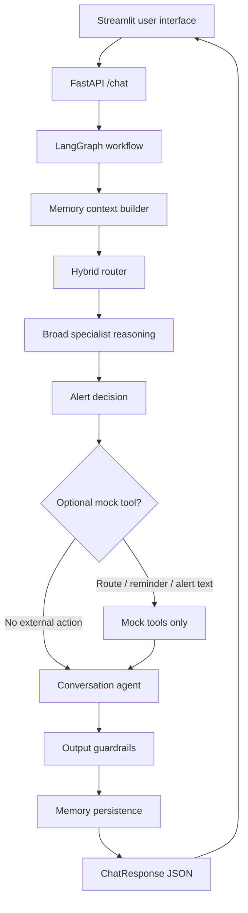
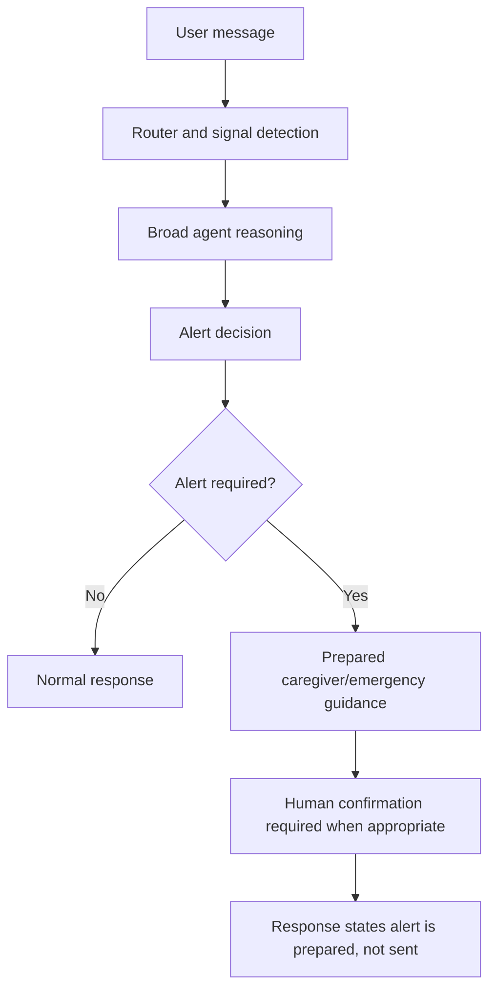
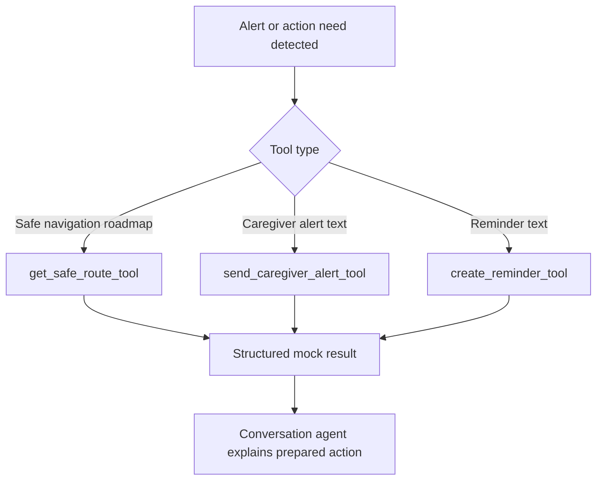
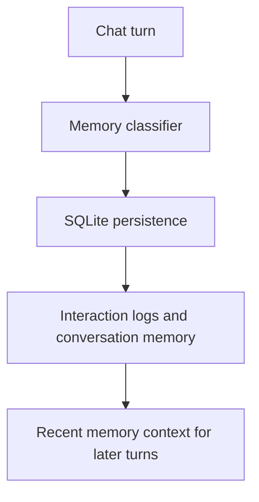

# ElderGuard AI System Architecture

## Request Flow

## Module Responsibilities

- `app/main.py`: creates the FastAPI app, initializes storage, and registers routers.
- `app/api/routes_chat.py`: owns the public chat endpoint.
- `app/api/routes_admin.py`: owns status and protected administrative operations.
- `app/api/dependencies.py`: owns API authorization dependencies.
- `app/api/errors.py`: creates sanitized API error responses while keeping tracebacks local.
- `app/graph.py`: currently owns the LangGraph workflow and much of the orchestration logic. This is still the largest module and remains the main Phase 2 refactoring target.
- `app/ml_router.py`: owns optional local ML route prediction and route explanations.
- `app/memory.py`: owns SQLite persistence functions.
- `app/rag.py`: owns the current local RAG/vector-store helpers.
- `app/tools.py`: owns mock-only safe route, caregiver alert, and reminder tools. These return structured dictionaries and do not call external services.
- `streamlit_app.py`: owns the user interface, XAI display, and technical trace views.

## Agent Responsibilities

- Safety agent: fraud, suspicious messages, unsafe pressure, and urgent safety signals.
- Health and daily care agent: health symptoms, medication uncertainty, food, mobility, and daily needs.
- Emotional and social agent: loneliness, sadness, anxiety, family support, and reassurance.
- Action agent: drafts messages, checklists, reminders, caregiver notes, and call scripts.
- Conversation agent: writes the final user-facing response.

## Safety Flow

The system is a decision-support prototype. It does not diagnose, prescribe, replace emergency services, or claim that caregiver alerts are sent unless a real notification integration exists.

## Optional Tool Calling Flow

These tools are mock-only. They prepare structured dictionaries for an interview demo and never call Google Maps, SMS, email, payment, medical, or emergency services.

## RAG Flow

The current RAG layer uses local knowledge files and a local vector store. Authoritative knowledge files live under `data/knowledge/`. Demonstration datasets under `data/raw/` must not be treated as verified medical guidance.

Future RAG work should separate ingestion, cleaning, chunking, embedding, indexing, retrieval, and citation generation into dedicated modules under `app/rag/`.

## Database Flow

SQLite is used for local development. Admin log access is protected by `ADMIN_API_TOKEN`; ordinary chat use does not require the admin token.

## Security Notes

- `.env` is ignored by Git.
- `/logs`, `/download-kaggle-datasets`, and `/rebuild-vector-store` require an admin token.
- `/status` avoids exposing local database and vector-store paths.
- Chat failures are returned as sanitized responses; raw tracebacks are written only to ignored local files.
