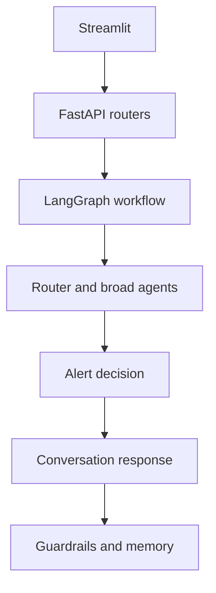

# ElderGuard AI Upgrade Report

## 1. Original Architecture Summary

The project started this pass with a working Streamlit and FastAPI prototype. The backend used LangGraph, SQLite memory, local rules, optional ML routing, mock/live LLM modes, RAG helpers, caregiver alert logic, and technical traces. The largest issue was coupling: `app/graph.py` still contained many responsibilities.

## 2. Final Architecture Summary

This pass completed Phase 1 security hardening and started Phase 2 with a small API-layer refactor.

Current request flow:



## 3. Security Changes

- Added `ADMIN_API_TOKEN` configuration.
- Protected `/logs`.
- Protected `/download-kaggle-datasets`.
- Protected `/rebuild-vector-store`.
- Kept `/chat` usable without an admin token.
- Removed local `sqlite_path` and `vector_store_path` from `/status`.
- Sanitized `/chat` error responses so tracebacks are not returned through the API.
- Kept tracebacks in ignored local files for debugging.

## 4. Refactoring Changes

Added `app/api/`:

- `app/api/dependencies.py`
- `app/api/errors.py`
- `app/api/routes_chat.py`
- `app/api/routes_admin.py`

Slimmed `app/main.py` so it now mainly creates the FastAPI app, initializes SQLite, and includes routers.

Large-scale `app/graph.py` decomposition has not been completed yet.

## 5. RAG Changes

No Phase 3 RAG upgrade was completed in this pass. The existing RAG behavior remains unchanged.

## 6. Database Changes

No Phase 5 database model migration was completed in this pass. SQLite behavior remains unchanged.

## 7. Frontend Changes

No new frontend role-separation work was completed in this pass. Existing Streamlit behavior and XAI display remain available.

## 8. Testing and Evaluation Results

Verified commands:

```powershell
.venv\Scripts\python.exe -m pytest tests/test_phase1_security.py tests/test_ml_router.py -q
.venv\Scripts\python.exe -m tests.run_ui_tests
.venv\Scripts\python.exe -m tests.run_alert_tests
.venv\Scripts\python.exe -m tests.run_guardrail_tests
.venv\Scripts\python.exe -m tests.run_llm_mode_tests
.venv\Scripts\python.exe -m tests.run_memory_classifier_tests
.venv\Scripts\python.exe -m tests.run_reasoning_workflow_tests
.venv\Scripts\python.exe -m py_compile app\main.py app\api\dependencies.py app\api\errors.py app\api\routes_chat.py app\api\routes_admin.py
```

Observed results:

- Phase 1 security tests: passed.
- ML router tests: passed.
- UI/privacy tests: passed.
- Alert tests: passed.
- Guardrail tests: passed.
- LLM mode tests: passed.
- Memory classifier tests: passed.
- Reasoning workflow tests: passed.

Warnings observed:

- FastAPI `on_event` deprecation warning.
- Joblib/NumPy deprecation warning in test model serialization.

## 9. Deployment Status

Docker, Docker Compose, CI, and deployment documentation were not completed in this pass.

## 10. Remaining Limitations

- Requested base branch `upgrade/portfolio-v2` was not available locally or on the configured remote.
- This branch was created from the current working branch instead.
- `app/graph.py` remains large and should be split in later Phase 2 work.
- RAG still needs the Phase 3 grounded retrieval upgrade.
- Database privacy/consent migrations remain future work.
- Frontend role separation remains future work.
- Caregiver alerts are prepared only; no real external notification is sent.
- ElderGuard remains a prototype and is not a medical device.

## 11. Files Added

- `app/api/__init__.py`
- `app/api/dependencies.py`
- `app/api/errors.py`
- `app/api/routes_chat.py`
- `app/api/routes_admin.py`
- `tests/test_phase1_security.py`
- `docs/architecture/system_architecture.md`
- `docs/upgrade_report.md`

## 12. Files Modified

- `.env.example`
- `app/config.py`
- `app/main.py`

Existing uncommitted files from earlier XAI/ML-router work are also present in the working tree.

## 13. Commands to Run Locally

```powershell
.venv\Scripts\activate
pip install -r requirements.txt
uvicorn app.main:app --reload
streamlit run streamlit_app.py
```

## 14. Commands to Run with Docker

Docker files were not added in this pass, so Docker commands are not available yet.

## 15. Known Blockers

- Missing required base branch: `upgrade/portfolio-v2`.
- Several later phases are too large to complete safely without review checkpoints.

## 16. Recommended Future Work

1. Finish decomposing `app/graph.py` into orchestration, routing, agents, safety, and observability modules.
2. Upgrade RAG with safe indexing, metadata, thresholds, and citations.
3. Add database migrations, consent, retention, and deletion.
4. Protect role-specific Streamlit views with backend authorization.
5. Add Docker, CI, evaluation reports, model/system cards, and portfolio documentation.
